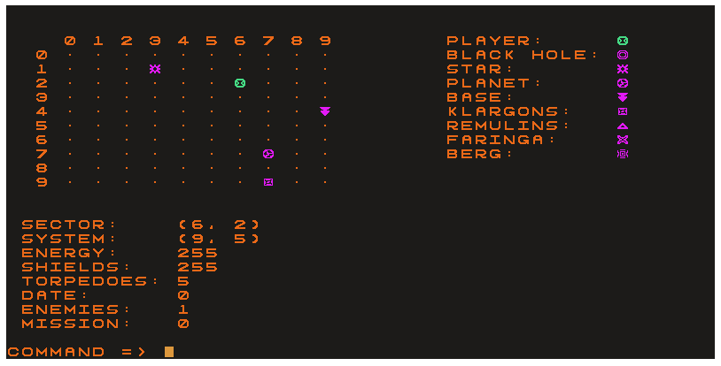

# Star Trip

*Star Trip* is a text-based game inspired by the
[Star Trek](https://en.wikipedia.org/wiki/Star_Trek_(1971_video_game))
and
[Super Star Trek](http://www.catb.org/~esr/super-star-trek/sst-doc.html)
games from the 1970s. The game presents the player with a command line
interface with which to control their ship and travel the galaxy.

**Try it here**:
[https://lewis-weinberger.github.io/posts/2023-09-23-star_trip.html](https://lewis-weinberger.github.io/posts/2023-09-23-star_trip.html)



## Installation

Requires the [Rust](https://www.rust-lang.org/tools/install)
toolchain and [wasm-pack](https://rustwasm.github.io/wasm-pack/installer/).

*Star Trip* is designed to be played in a (modern) browser using
WebAssembly. First you need to build the web assets:

```sh
git clone https://github.com/lewis-weinberger/star_trip.git
cd star_trip
wasm-pack build --release \
                --target web \
                --no-pack \
                --no-typescript \
                --out-dir www/pkg
```

This will populate the `www/pkg` directory. Next you need
to run a local web server
(e.g. using [Python](https://www.python.org/downloads/)):

```sh
python3 -m http.server 5000 -d www
```

With this local server running you can load the game in
your browser at [0.0.0.0:5000/index.html](http://0.0.0.0:5000/index.html).

**Note**: whilst it should be possible to play on a mobile device, as it
is a text-based game this may not be an enjoyable experience! Furthermore, some browsers on mobile devices may not work at all (Chrome on Android, for example) as it is unfortunately not straightforward to detect key input from the software keyboard.

## Gameplay

The player's goal is to guide their starship and destroy hostile
enemy ships in nearby sectors.

Try the `HELP` command for a list of instructions the game understands.

Refresh the page to start again!

## License

[ISC](./LICENSE)

"Star Trek" is a registered trademark of CBS Studios, Inc.

Whilst inspired by the original Star Trek games, *Star Trip* has
been written completely from scratch and the game content
(including graphical tileset) has been carefully designed to avoid
any copyright infringement.
